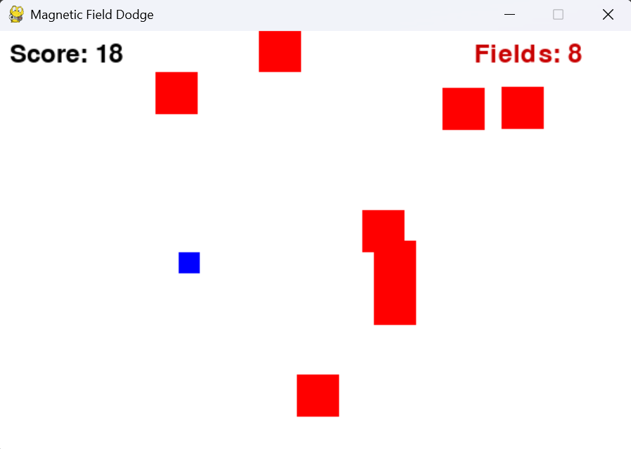

# Magnetic Field Dodge 🎮

A simple physics-inspired survival game built with **Python** and **Pygame**.  
You control a blue charged particle and must dodge moving red fields.  
Survive as long as possible. One hit and it’s game over!

---

## 📸 Preview



---

## ✨ Features
- Control a charged particle (blue square) with arrow keys
- Randomly spawning red fields (hazards)
- Fields bounce around and increase in number over time
- Invincibility grace period at the start
- Score increases the longer you survive

---

## 🎮 How to Play
1. Use **arrow keys** to move the blue square.
2. Avoid the red squares (fields).
3. You are invincible for the first 3 seconds.
4. Survive as long as possible to achieve the highest score.

---

## ⚙️ Installation
1. Clone this repository:
   ```bash
   git clone https://github.com/your-username/magnetic-field-dodge.git
   cd magnetic-field-dodge
2. (Optional) Create a virtual environment:
   ```bash
   python -m venv .venv
   source .venv/bin/activate   # Linux/Mac
   .venv\Scripts\activate      # Windows
3. Install dependencies
   (if you don’t have requirements.txt yet, just run pip install pygame)
   ```bash
   pip install -r requirements.txt
4. Run the game:
   ```bash
   python index.py
